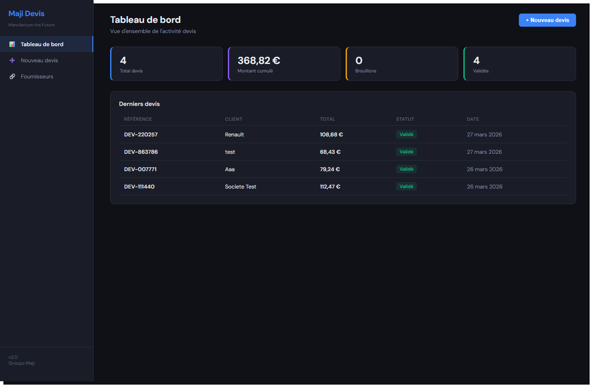
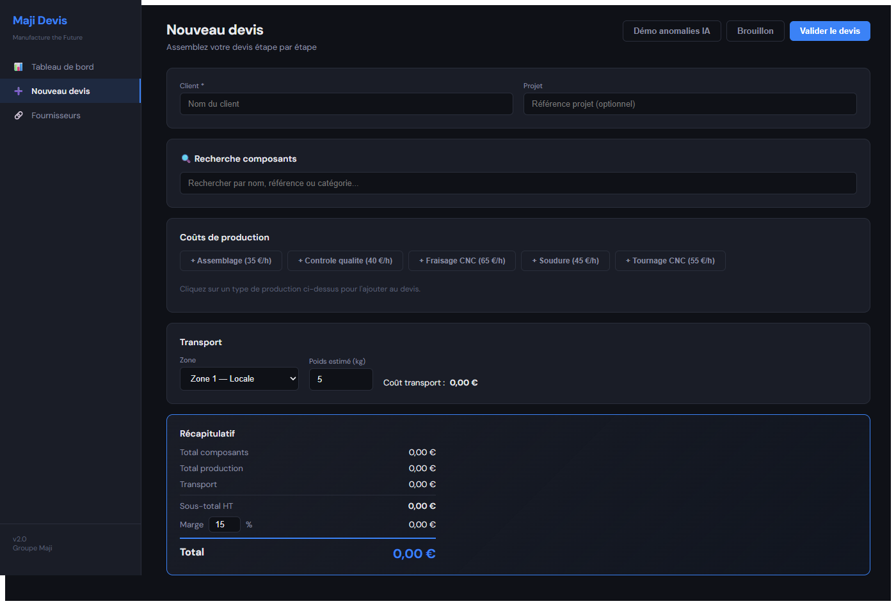
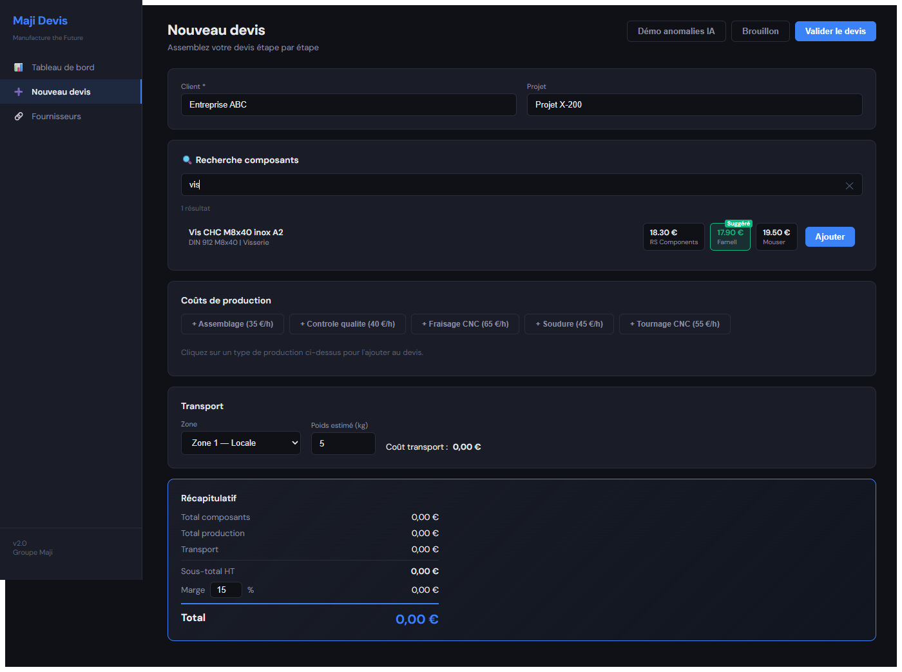
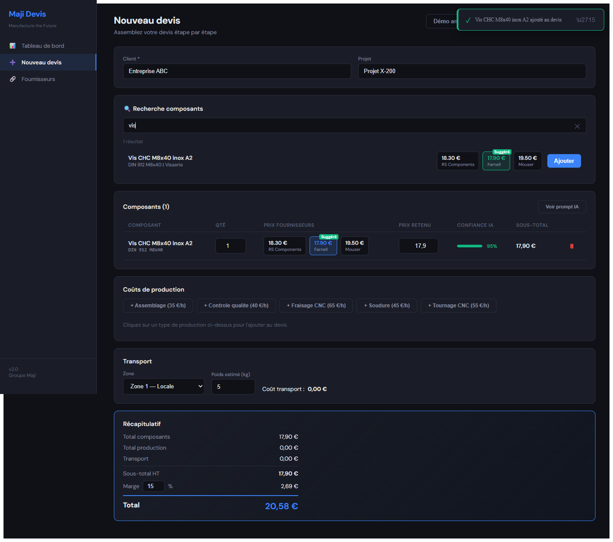
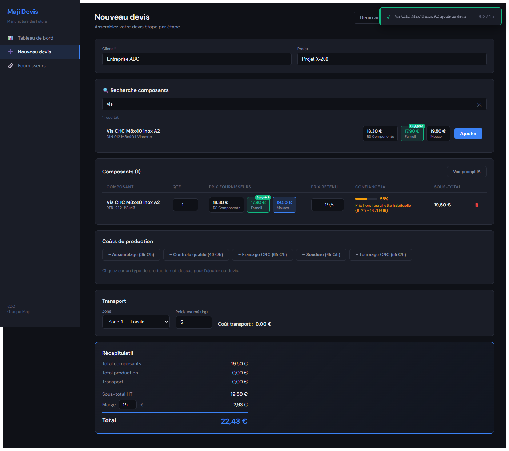
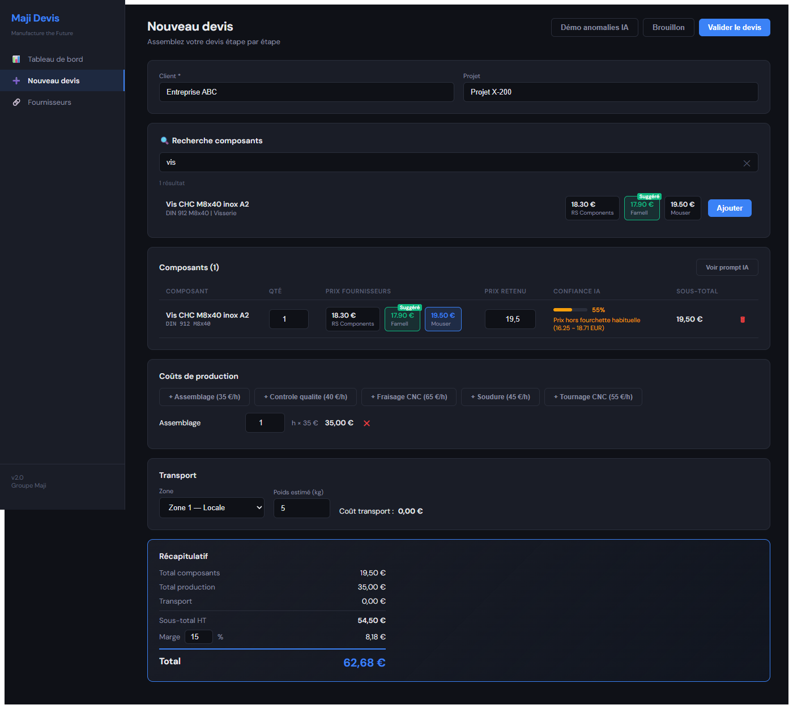
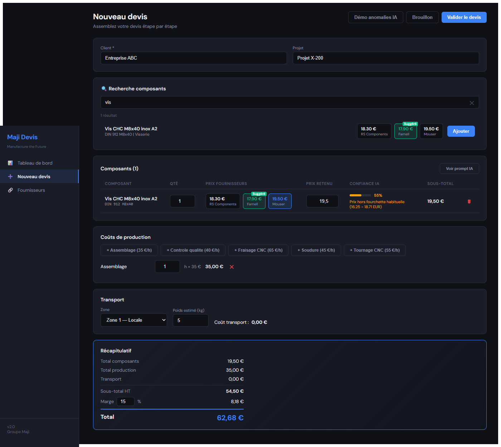
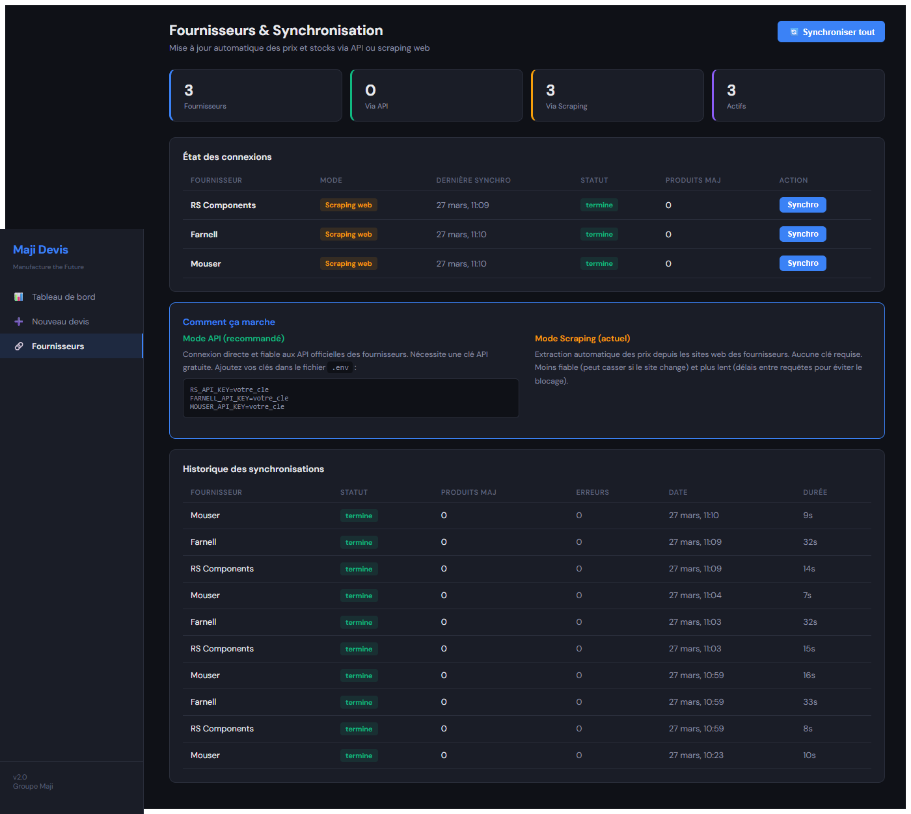

# Maji Devis — Parcours Utilisateur

**Application** : Maji Devis — Manufacture the Future  
**URL** : https://maji-devis-production.up.railway.app/  
**Version** : 2.0

---

## 1. Tableau de bord

Au lancement de l'application, l'utilisateur arrive sur le **tableau de bord** qui présente une vue d'ensemble de l'activité.

**Éléments visibles :**
- **4 indicateurs** : nombre total de devis, montant cumulé, brouillons en cours, devis validés
- **Tableau des derniers devis** avec référence, client, total, statut (badge coloré) et date
- **Bouton « + Nouveau devis »** en haut à droite pour créer un devis
- **Barre latérale** avec navigation vers les 3 sections principales

**Actions possibles :**
- Cliquer sur une ligne du tableau pour consulter le détail d'un devis
- Cliquer sur « + Nouveau devis » pour démarrer un chiffrage

---

## 2. Création d'un nouveau devis (formulaire vide)

L'utilisateur clique sur **« Nouveau devis »** dans la barre latérale ou le bouton du dashboard.

**Éléments visibles :**
- **Champ Client** (obligatoire, marqué d'un astérisque) et **Champ Projet** (optionnel)
- **Recherche composants** : barre de recherche pour trouver des pièces dans le catalogue
- **Coûts de production** : boutons pour ajouter des postes (Assemblage, Contrôle qualité, Fraisage CNC, Soudure, Tournage CNC) avec leur taux horaire
- **Transport** : sélection de la zone et du poids estimé — coût à 0,00 € par défaut
- **Récapitulatif** : tous les montants à 0,00 € au départ
- **Boutons d'action** : « Démo anomalies IA », « Brouillon », « Valider le devis »

---

## 3. Recherche et sélection d'un composant

L'utilisateur saisit un terme de recherche (ex : « vis ») dans la barre. Les résultats du catalogue s'affichent en temps réel.

**Éléments visibles :**
- **Résultats de recherche** avec nom du composant, référence et catégorie
- **Prix comparés** de chaque fournisseur (RS Components, Farnell, Mouser)
- **Badge « Suggéré »** en vert sur le meilleur prix (ici Farnell à 17,90 €)
- **Bouton « Ajouter »** pour inclure le composant dans le devis
- **Nombre de résultats** affiché (« 1 résultat »)
- **Bouton ✕** pour vider la recherche

---

## 4. Composant ajouté au devis

Après avoir cliqué sur « Ajouter », le composant apparaît dans le tableau du devis. Un **toast de confirmation** s'affiche en haut à droite.

**Éléments visibles :**
- **Tableau Composants (1)** avec les colonnes : Composant, Qté, Prix fournisseurs, Prix retenu, Confiance IA, Sous-total
- **Cartes de prix cliquables** : chaque fournisseur est affiché et l'utilisateur peut cliquer pour choisir un prix
- **Prix retenu** : automatiquement rempli avec le meilleur prix (17,90 €), modifiable
- **Confiance IA** : barre de progression verte (95%) indiquant que le prix est fiable
- **Toast** : notification « Vis CHC M8x40 inox A2 ajouté au devis »
- **Récapitulatif** mis à jour automatiquement (Total : 20,58 €)

> **Astuce** : Si l'utilisateur re-clique « Ajouter » sur le même composant, la quantité augmente de +1 au lieu de créer un doublon.

---

## 5. Choix libre du prix fournisseur

L'utilisateur peut **cliquer sur la carte d'un autre fournisseur** pour changer le prix retenu. Ici, le prix Mouser (19,50 €) a été sélectionné.

**Éléments visibles :**
- **Carte Mouser** entourée en bleu = prix sélectionné (19,50 €)
- **Carte Farnell** reste en vert = prix suggéré par l'IA (17,90 €)
- **Prix retenu** mis à jour à 19,50 €
- **Confiance IA** passée à 55% (orange) avec message d'alerte : « Prix hors fourchette habituelle (16,25 – 18,71 EUR) »
- **Sous-total** et **Récapitulatif** recalculés automatiquement

> L'IA détecte que le prix choisi est supérieur à la fourchette normale et avertit l'utilisateur, tout en le laissant libre de son choix.

---

## 6. Ajout de coûts de production

L'utilisateur clique sur un bouton de type de production (ex : « + Assemblage (35 €/h) ») pour l'ajouter au devis.

**Éléments visibles :**
- **Ligne Assemblage** ajoutée : 1 heure × 35 € = 35,00 €
- **Champ heures** modifiable
- **Bouton ✕** pour retirer le poste
- **Transport** toujours à 0,00 € (se calcule quand l'utilisateur modifie la zone ou le poids)
- **Récapitulatif** : composants 19,50 € + production 35,00 € + marge 15% = **Total 62,68 €**

---

## 7. Récapitulatif complet

Vue du récapitulatif avec tous les postes chiffrés.

**Éléments visibles :**
- **Total composants** : 19,50 €
- **Total production** : 35,00 €
- **Transport** : 0,00 €
- **Sous-total HT** : 54,50 €
- **Marge** : 15% = 8,18 € (pourcentage modifiable)
- **Total** : **62,68 €** affiché en bleu

**Actions finales :**
- **« Brouillon »** : enregistre le devis sans le finaliser
- **« Valider le devis »** : enregistre avec le statut « Validé »
- Le devis sera ensuite visible sur le tableau de bord et téléchargeable en PDF

---

## 8. Fournisseurs & Synchronisation

La page Fournisseurs permet de gérer les connexions aux fournisseurs et la mise à jour des prix.

**Éléments visibles :**
- **4 indicateurs** : 3 fournisseurs, 0 via API, 3 via Scraping, 3 actifs
- **Tableau des connexions** : RS Components, Farnell, Mouser — mode (Scraping web), dernière synchro, statut, bouton « Synchro » individuel
- **Encart explicatif** : Mode API (recommandé, avec clés) vs Mode Scraping (actuel, sans clé)
- **Historique des synchronisations** : tableau avec statut, produits mis à jour, erreurs, date et durée
- **Bouton « Synchroniser tout »** en haut à droite

---

## Fonctionnalités transversales

| Fonctionnalité | Description |
|---|---|
| **Notifications toast** | Confirmations et erreurs affichées en haut à droite, disparaissent après 4 secondes |
| **Validation du formulaire** | Le champ Client est obligatoire — bordure rouge si vide à la sauvegarde |
| **Confirmation de suppression** | Dialogue de confirmation avant de retirer un composant du devis |
| **Téléchargement PDF** | Depuis la page de détail d'un devis, bouton pour télécharger le devis en PDF |
| **Détection d'anomalies IA** | Score de confiance et message d'alerte si le prix est hors norme |
| **Fermeture Escape** | Toutes les modales se ferment avec la touche Escape |
| **Navigation clavier** | Items de menu et lignes de tableau accessibles avec Enter |

---

*Document généré le 27 mars 2026 — Maji Devis v2.0*
